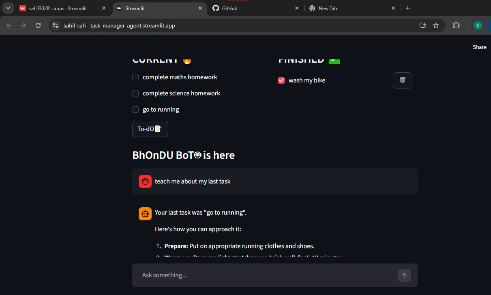

# 🤖 AI Task Manager Agent

A smart **Task Manager Agent** built using **Python and Streamlit**, designed to manage tasks interactively while simulating basic AI-driven behavior.

Unlike a traditional to-do list, this project focuses on creating an **agent-like experience**, where the system can understand user input and perform actions such as adding, viewing, and managing tasks dynamically.

---

## ✨ Features

### 1. Add Tasks

Users can add tasks through input, and the system stores them dynamically.

### 2. View Tasks

Displays all tasks along with their current status (completed / pending).

### 3. Agent-like Interaction

The system is designed to behave like a simple **task management agent**, capable of interpreting user intent and executing relevant actions.

### 4. Session-Based Storage

Tasks are stored using **Streamlit session state**, allowing persistence during runtime.

---

## 🧠 Agent Concept

This project simulates an **AI agent workflow**, where:

* User input is interpreted
* The system decides the action (add/view/manage)
* Tasks are updated accordingly

Example:

Input → "Add task to study DSA"
Agent → Detects intent → Adds task

---

## 📸 Application Preview



---

## 📁 Project Structure

task-manager-agent/
│
├── app.py
├── file_handling.py
├── .env
├── screenshots/
│   └── app-preview.png
└── README.md

---

## 💻 Example Code Snippet

```python
def add_task(text=None):
    if text is None:
        if st.session_state.new.strip():
            text = st.session_state.new.strip()
        else:
            return

    if "tasks" not in st.session_state:
        st.session_state.tasks = []

    st.session_state.tasks.append({
        "task": text,
        "status": False
    })
```

---

## 💻 Example Usage

### Adding a Task

Input:
Add task to complete project

Output:
Task added successfully

---

### Viewing Tasks

* Complete project → Pending
* Practice DSA → Pending

---

## ⚙️ How to Run

Install dependencies:

pip install streamlit python-dotenv

Run the app:

streamlit run app.py

---

## 🛠 Technologies Used

* Python
* Streamlit
* Session State
* dotenv

---

## ⚠️ Challenges Faced

* Managing session state correctly
* Handling user input dynamically
* API request limitations (rate limits)
* Designing agent-like behavior without full AI backend

---

## 🚀 Future Improvements

* Integrate real LLM APIs
* Add task prioritization
* Enable deadlines and reminders
* Store tasks in a database (SQLite)
* Improve UI/UX

---

## 🎯 Learning Outcomes

* Built an interactive Streamlit app
* Understood state management
* Designed an agent-like workflow
* Improved debugging and logic building

---

## 👨‍💻 Author

Sahil Sah